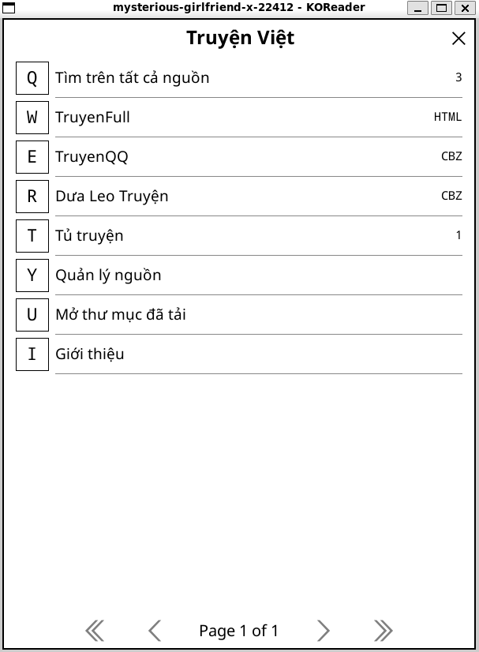
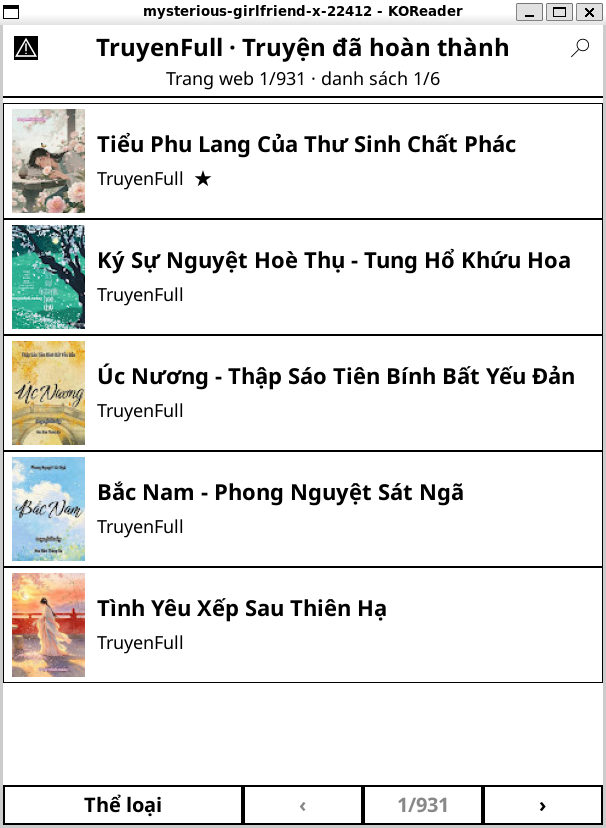
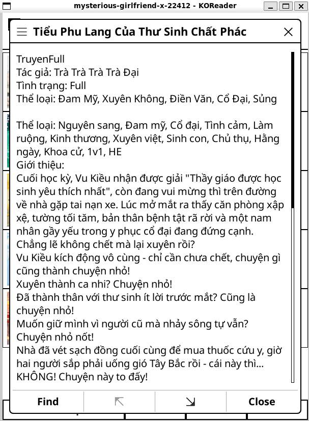
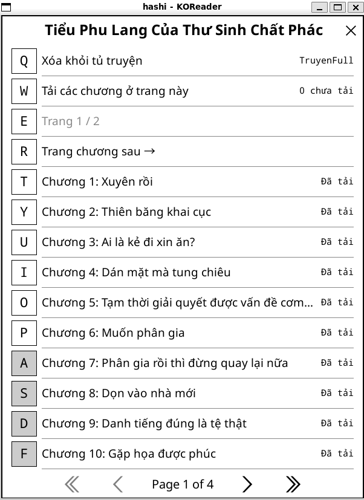
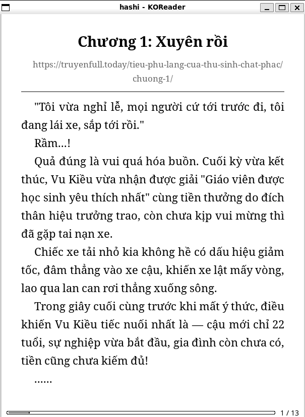

# Truyện Việt cho KOReader

Plugin KOReader thuần Lua để tìm và đọc:

- Truyện chữ từ [truyenfull.today](https://truyenfull.today/)
- Truyện tranh từ [truyenqqko.com](https://truyenqqko.com/)
- Truyện tranh từ [dualeotruyenbs.com](https://dualeotruyenbs.com/)
- Truyện tranh từ [cbunu.com](https://cbunu.com/)
- Truyện tranh từ [haccbl.xyz](https://haccbl.xyz/)
- Truyện chữ từ [truyendich.ai](https://truyendich.ai/)

Plugin tải chương về thư mục dữ liệu KOReader rồi mở bằng trình đọc có sẵn:

- TruyenFull được lưu dưới dạng HTML.
- TruyenQQ và Dưa Leo được đóng gói thành CBZ, phù hợp với trình đọc manga của KOReader.

## Tính năng

- Chạm vào từng nguồn để mở ngay danh sách truyện đã hoàn thành.
- Tìm riêng trong nguồn bằng nút kính lúp, lọc theo thể loại và chuyển trang ngay trên danh sách.
- Tìm đồng thời trên mọi nguồn đang bật hoặc tìm theo từng nguồn.
- Chuẩn hóa dấu tiếng Việt, ưu tiên tên khớp chính xác, khớp đầu chuỗi và độ phủ từ khóa.
- Hiển thị ảnh bìa bên trái, tên truyện và nguồn bên phải.
- Cache ảnh bìa để mở lại kết quả và tủ truyện nhanh hơn.
- Bật/tắt nguồn trong plugin.
- Giữ tên truyện để xem mô tả hoặc thêm/xóa khỏi tủ truyện.
- Xem danh sách chương và phân trang TruyenFull.
- Tải các chương chưa có ở trang mục lục hiện tại.
- Lưu truyện vào tủ truyện.
- Nhận biết chương đã tải.
- Mở lại, tải lại hoặc xóa từng chương.
- Nút `Quay lại Truyện Việt` trong menu khi đang đọc chương.
- Menu plugin và thư mục chương đã tải vẫn mở được khi offline.

## Ảnh chụp màn hình

| Trang chính | Danh sách truyện có ảnh bìa |
| :---: | :---: |
|  |  |

| Chi tiết và mô tả truyện | Mục lục và tải chương |
| :---: | :---: |
|  |  |

### Đọc truyện trong KOReader

<p align="center">
  
</p>

## Cài đặt

1. Tải `truyenviet.koplugin.zip` trong thư mục `dist` hoặc trang phát hành.
2. Giải nén để nhận thư mục `truyenviet.koplugin`.
3. Chép nguyên thư mục đó vào thư mục `plugins` của KOReader.
4. Khởi động lại KOReader.
5. Mở menu chính và chọn `Truyện Việt`.

Tùy cách cài KOReader, đường dẫn thường có dạng:

```text
Android: /sdcard/koreader/plugins/truyenviet.koplugin
Kindle:  /mnt/us/koreader/plugins/truyenviet.koplugin
Kobo:    /mnt/onboard/.adds/koreader/plugins/truyenviet.koplugin
```

Thư mục phải kết thúc bằng `.koplugin`; không chép riêng các file Lua ra ngoài.

Plugin chỉ dùng API đa nền tảng có sẵn của KOReader và định dạng HTML/CBZ, nên
cùng một gói ZIP có thể dùng trên Android, Kindle và Kobo. Kindle phải được
jailbreak và cài KOReader trước. Trên thiết bị cũ có ít RAM, nên tải từng trang
mục lục thay vì tải quá nhiều chương manga liên tiếp.

## Sử dụng

- Chạm vào nguồn (như `TruyenFull`, `TruyenQQ`, `Hắc Ám Chi Các`, v.v.) để xem các truyện đã hoàn thành.
- Trong màn hình của một nguồn, dùng nút kính lúp để tìm kiếm; dùng `Thể loại`, `‹`, `›` ở thanh dưới để lọc và chuyển trang web.
- Vuốt danh sách hoặc dùng phím chuyển trang để xem các truyện còn lại trong trang web hiện tại.
- Chạm một truyện để mở danh sách chương.
- Giữ tên truyện để xem mô tả hoặc thêm/xóa khỏi tủ truyện.
- Chạm một chương để tải và đọc.
- Chọn `Tải các chương ở trang này` trong mục lục để tải hàng loạt các chương chưa có.
- Giữ tên chương để mở, tải lại hoặc xóa bản đã tải.
- Trong trình đọc, mở menu và chọn `Quay lại Truyện Việt` để trở về danh sách chương.

Chương manga có thể chứa hàng trăm ảnh và tốn nhiều thời gian, dung lượng lưu trữ. Plugin ghi từng ảnh trực tiếp vào CBZ để hạn chế sử dụng RAM.

## Phát triển

Cấu trúc chính:

```text
truyenviet.koplugin/
  main.lua
  truyenviet/
    browser.lua
    chapter_downloader.lua
    cover_cache.lua
    document_builder.lua
    http_client.lua
    reader.lua
    search_service.lua
    source_registry.lua
    widgets/
      story_results.lua
    sources/
      cbunu.lua
      dualeo.lua
      haccbl.lua
      truyendich.lua
      truyenfull.lua
      truyenqq.lua
```

Đóng gói trên Windows:

```powershell
./scripts/build.ps1
```

Đóng gói trên Linux/macOS:

```sh
./scripts/build.sh
```

Chạy kiểm thử parser độc lập:

```sh
lua spec/parser_test.lua
lua spec/chapter_downloader_test.lua
lua spec/storage_test.lua
lua spec/story_results_test.lua
lua spec/reader_test.lua
lua spec/document_builder_test.lua
lua spec/image_utils_test.lua
lua spec/compile_test.lua .
```

Các parser specs dùng Busted nằm tại `spec/parser_spec.lua`.

## Kiểm thử

### 1. Chạy KOReader trên Windows qua WSL

KOReader không có bản Windows native chính thức. Trên Windows 11, có thể chạy
bản Linux bằng WSL2/WSLg để kiểm tra giao diện, tải truyện, tạo HTML/CBZ và mở
chương ngay trên PC.

Mở Ubuntu:

```powershell
wsl -d Ubuntu
```

Trong Ubuntu, tải và cài KOReader:

```sh
cd /tmp
wget https://github.com/koreader/koreader/releases/download/v2026.03/koreader_2026.03-1_amd64.deb
sudo apt install ./koreader_2026.03-1_amd64.deb
```

Liên kết plugin đang phát triển vào thư mục dữ liệu KOReader:

```sh
mkdir -p ~/.config/koreader/plugins
ln -sfnT /mnt/d/Project/truyenfull/truyenviet.koplugin ~/.config/koreader/plugins/truyenviet.koplugin
```

Khởi chạy:

```sh
koreader
```

Sau mỗi lần sửa Lua, thoát và mở lại KOReader. Log nằm tại:

```text
~/.config/koreader/crash.log
```

### 2. Kiểm tra parser trên máy tính

Máy cần Lua 5.1 hoặc LuaJIT:

```powershell
lua .\spec\parser_test.lua
```

Kết quả đúng có dạng:

```text
Parser tests passed: 49 assertions
Chapter downloader tests passed: 5 assertions
Storage tests passed: 19 assertions
Story results tests passed: 18 assertions
Reader tests passed: 10 assertions
Document builder tests passed: 6 assertions
Image utils tests passed: 4 assertions
Lua compile tests passed: 19 files
```

Sau đó tạo gói cài:

```powershell
.\scripts\build.ps1
```

Trong Ubuntu/WSL có thể dùng:

```sh
sudo apt install lua5.1
cd /mnt/d/Project/truyenfull
lua5.1 spec/parser_test.lua
```

### 3. Cài bản thử lên Android

Giải nén `dist/truyenviet.koplugin.zip`, sau đó chép cả thư mục
`truyenviet.koplugin` vào:

```text
/sdcard/koreader/plugins/
```

Có thể dùng ADB:

```powershell
adb push .\truyenviet.koplugin /sdcard/koreader/plugins/truyenviet.koplugin
```

Thoát hoàn toàn rồi mở lại KOReader. Trong menu chính phải xuất hiện mục
`Truyện Việt`.

### 4. Checklist trên KOReader

1. Chạm lần lượt TruyenFull, TruyenQQ và Dưa Leo; mỗi nguồn phải tự mở danh sách truyện đã hoàn thành có bìa.
2. Trong từng nguồn, thử nút kính lúp, chọn một thể loại và chuyển sang trang web kế tiếp.
3. Tìm `phàm nhân` trên tất cả nguồn; kết quả khớp sát phải đứng trước và mỗi hàng có bìa.
4. Tìm riêng trên TruyenFull, mở danh sách chương và kiểm tra phân trang.
5. Mở một chương chữ; KOReader phải mở tệp HTML và hiển thị tiếng Việt đúng.
6. Tìm truyện trên TruyenQQ và Dưa Leo, mở một chương ngắn và chờ tạo CBZ.
7. Lật qua nhiều trang manga để chắc chắn ảnh không bị thiếu hoặc sai thứ tự.
8. Mở menu khi đang đọc và chọn `Quay lại Truyện Việt`.
9. Giữ tên truyện, mở `Xem chi tiết truyện`, sau đó thêm vào tủ truyện; khởi động lại KOReader và kiểm tra mục
   yêu thích vẫn còn.
10. Vào `Quản lý nguồn`, tắt Dưa Leo rồi bật lại từ trang chính và từ màn hình quản lý.
11. Trong mục lục, chọn `Tải các chương ở trang này`, xác nhận các chương đã có được bỏ qua.
12. Tắt mạng; kiểm tra menu plugin và các chương đã tải vẫn mở được.
13. Giữ tên chương, thử tải lại rồi xóa bản đã tải.

Nếu plugin không xuất hiện hoặc KOReader thoát, xem `crash.log` trong thư mục dữ
liệu KOReader và tìm các dòng chứa `truyenviet`.

## Lưu ý

Đây là trình đọc phía khách, không chứa nội dung truyện. Website nguồn có thể thay đổi HTML, CDN hoặc chính sách chống hotlink, khi đó parser cần được cập nhật. Người dùng tự chịu trách nhiệm tuân thủ điều khoản của website nguồn và quyền tác giả tại nơi mình sinh sống.
